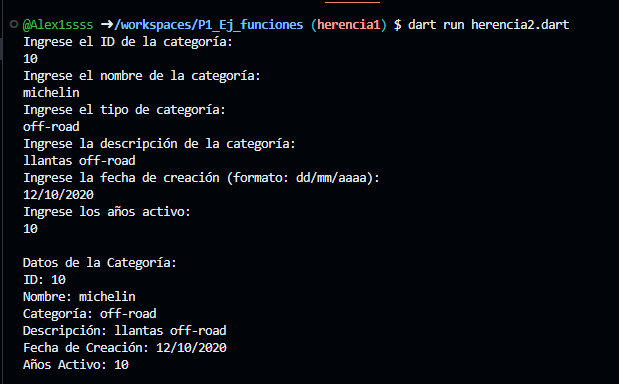
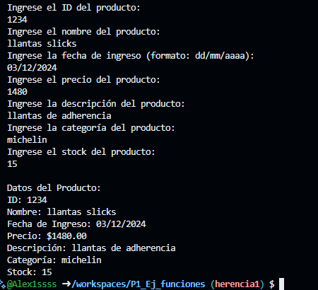

- crear la clase categoria con los atributos (id_categoria, nombre,categoria, descripcion_categoria, fecha_creacion, anios_activo) con una función captura datos(), con interacción de interfaz de usuario, crear la clase DatosCategoria con herencia categoria y una función mostrarDatos(). lenguaje dart
- salida categoria
- 
- 
- crear la clase productos con los atributos (id_producto, nombre_producto, fecha_ingreso, precio_producto, descripcion, categoria_producto y stock) con una función captura datos(), con interacción de interfaz de usuario, crear la clase DatosProductos con herencia productosy una función mostrarDatos(). lenguaje dart
- salida productos
- 