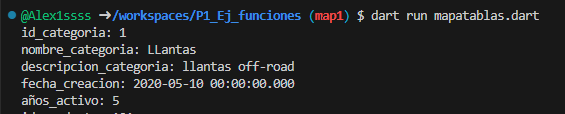
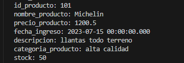
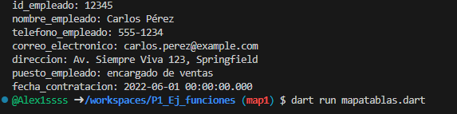
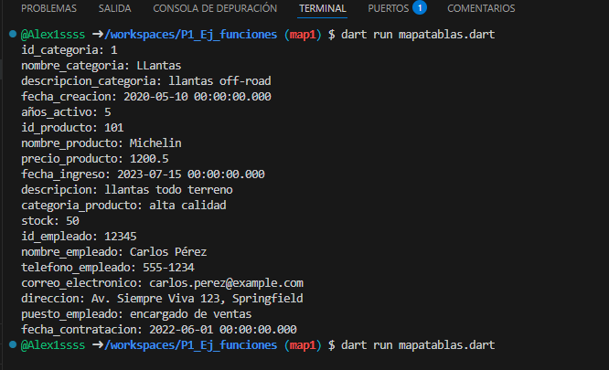

- crear map <string, dinamic> categorias con los siguientes key, id_categoria, nombre_categoria, descripcion_categoria.fecha_creacion, años activo y mostrar los datos con un foreach. lenguaje Dart
- 
- crear map <string, dinamic> productoscon los siguientes key, id_producto, nombre_producto, precio_producto, fecha_ingreso, descripcion, categoria_producto, stock y mostrar los datos con un foreach. lenguaje Dart
- 
- crear map <string, dinamic> empleados con los siguientes key, id_empleado, nombre_empleado, telefono_empleado, correo_electronico, direcion, puesto_empleado y fecha_contratacion y mostrar los datos con un foreach. lenguaje Dart
- 

- imagen general
- 